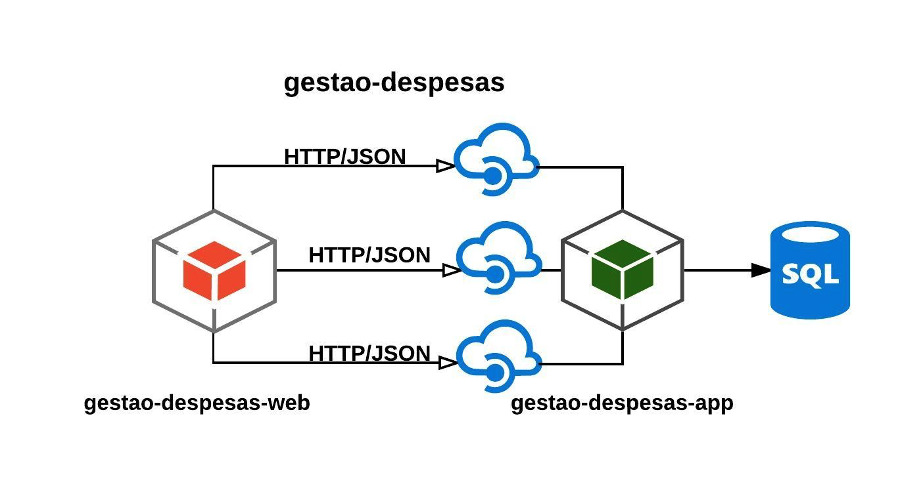

Link apresentação no TDC 2017 - Florianópolis: https://www.slideshare.net/emmanuelnerisouza/a-trilogia-spring-mvc-spring-data-angularjs

# Visão geral

Esse projeto é um [CRUD](https://en.wikipedia.org/wiki/Create,_read,_update_and_delete) de gestão de despesas que visa demonstrar o uso de diversas tecnologias, sendo as principais delas: [AngularJS](https://angularjs.org/), [Spring MVC](https://docs.spring.io/spring/docs/current/spring-framework-reference/html/mvc.html) e [Spring Data JPA](http://projects.spring.io/spring-data-jpa/).

# Arquitetura

A aplicação está separada em dois módulos, sendo um com a responsabilidade de tratar as necessidades de interface do usuário e o outro dedicado a fornecer as apis dessa aplicação. Na literatura essas separações são intituladas como [front-end e back-end](https://pt.wikipedia.org/wiki/Front-end_e_back-end), respectivamente.

A comunicação e o tráfego de dados entre esses módulos se dá através de ações simbolizadas por [verbos HTTP](https://developer.mozilla.org/en-US/docs/Web/HTTP/Methods) e arquivos [JSON](https://en.wikipedia.org/wiki/JSON), seguindo um padrão conhecido como [REST](https://en.wikipedia.org/wiki/Representational_state_transfer).

A figura abaixo exemplifica o desenho arquitetural da aplicação:


# Tecnologias

Sabemos que o desenvolvimento de software moderno se tornou um processo no qual a diversidade de tecnologias existentes é muito grande. Aqui empregamos uma série de ferramentas e bibliotecas para o desenvolvimento de cada módulo. Vamos comentar as principais utilizadas, tanto para front-end quanto para back-end.

## Front-end

Como mencionado na seção ["Arquitetura"](#heading=h.wvb1viybgtwc), o front-end é o módulo responsável por prover de fato as telas de interação com o usuário. Estas foram criadas utilizando [HTML5](https://en.wikipedia.org/wiki/HTML5), [CSS3](https://developer.mozilla.org/en/docs/Web/CSS/CSS3) e [Bootstrap](http://getbootstrap.com/).

A apresentação dos dados na tela ficou por conta do [AngularJS](https://angularjs.org/). Usamos [node](https://en.wikipedia.org/wiki/Node.js) + [express](https://expressjs.com/) para servir conteúdo estático. A instalação e gestão das bibliotecas e dos pacotes utilizados foram feitos através do [bower](https://bower.io/) e do [npm](https://www.npmjs.com/). Por fim, para o build da aplicação foi escolhido o [grunt](https://gruntjs.com/).

## Back-end

Já o back-end, como mencionado anteriormente, é o módulo responsável por prover os serviços que a aplicação possui, ou seja, as apis. Para a criação das mesmas, foi seguido o padrão [REST](https://en.wikipedia.org/wiki/Representational_state_transfer).

O [Spring MVC](https://docs.spring.io/spring/docs/current/spring-framework-reference/html/mvc.html) foi a tecnologia escolhida para a criação das apis [REST](https://en.wikipedia.org/wiki/Representational_state_transfer). A [camada de acesso a dados](https://en.wikipedia.org/wiki/Data_access_layer) ficou por conta do [Spring Data JPA.](http://projects.spring.io/spring-data-jpa/) A persistência de dados é feita num banco [PostgreSQL](https://en.wikipedia.org/wiki/PostgreSQL). Inclusive, para controlar as mudanças realizadas no [database schema](https://en.wikipedia.org/wiki/Database_schema) é utilizada uma biblioteca chamada [flyway](https://flywaydb.org/). Por fim, o [build](https://en.wikipedia.org/wiki/Software_build) da aplicação e a gestão de bibliotecas ficam por conta do [maven](https://maven.apache.org/).

# Setup da aplicação

## Pré-requisito

Antes de rodar a aplicação é preciso garantir que as seguintes dependências estejam corretamente instaladas:
```
Java 8
PostgreSQL 9.3.10 ou superior
maven 3.3.3 ou superior
node v7.0.0 ou superior
bower 1.8.0 ou superior
grunt-cli 1.2.0 ou superior
```
**Atenção:** as versões citadas acima foram as utilizadas no desenvolvimento, ou seja, são as que garantimos que irá funcionar corretamente.

## Instalação

A aplicação está separada em dois módulos, como já mencionado [anteriormente](#heading=h.wvb1viybgtwc). Sendo assim, é necessária a instalação separada de cada um desses módulos.

Primeiramente, faça o clone do repositório:
```
git clone git@github.com:emmanuelneri/gestao-despesas.git
```
Feito isso, acesse o projeto:
```
cd gestao-despesas
```
Vamos iniciar a configuração do módulo web. Execute os comandos abaixo para acessá-lo e instalar suas dependências:
```
cd despesas-web
npm install
bower install
node server
```
Após isso, provavelmente você está vendo a seguinte mensagem no console:
```
Hi! Seu servidor está no ar, escutando na porta 3000.
```
Pronto. Basta abrir o browser e acessar a url abaixo:
```
http://localhost:3000/
```
Por padrão a aplicação irá rodar na porta **3000**. Se preferir rodá-la numa porta diferente, basta informar o parâmetro **port** no momento de iniciar o servidor:
```
node server --port=8500
```
Nosso módulo web já está no ar. Podemos navegar pelas telas, porém não conseguimos executar nenhuma operação (criar ou buscar uma despesa, por exemplo) visto que essas funcionalidades dependem do backend, o qual ainda não foi configurado.

E é isso que faremos agora. Antes de iniciar a configuração do módulo de backend, garanta que exista um database criado com o nome **"gestao-despesas"**. Não vamos entrar em detalhes como isso é feito, porém na internet existe uma série de artigos explicando como fazê-lo. Se não possuir intimidade com o [psql](http://postgresguide.com/utilities/psql.html), recomendo instalar o [pgAdmin](https://www.pgadmin.org/) para esse tipo de tarefa.

Vamos à configuração do nosso backend. Primeiramente, abra uma nova aba no seu terminal (**CTRL+SHIFT+T**, em ambientes [unix](https://en.wikipedia.org/wiki/Unix)). Por favor, não feche a aba que está executando o módulo web.

Feito isso, vamos acessar o diretório do nosso módulo de backend:
```
cd despesas-app
```
É preciso compilar o código e baixar as dependências do projeto:
```
mvn clean compile
```
Finalizado esse passo, vamos iniciar a aplicação:
```
mvn spring-boot:run
```
Pronto. Se tudo ocorreu bem, você verá uma mensagem semelhante à essa:
```
Started AppConfig in xxxx seconds (JVM running for xxxx)
```
A aplicação está no ar, porém não existem dados cadastrados. Se deseja validar rapidamente a aplicação, recomendo inserir os dados contidos no arquivo ```popular-base.sql``` dentro da pasta ```scripts```.

# Setup alternativo (Docker)

## Pré-requisito

Os pré-requistos são similares ao setup demonstrado acima, pois a aplicação será construída localmente e apenas executada no Docker, assim, é preciso acrescentar a instalação do Docker com versão 1.13.0+.

## Instalação da aplicação

A instalação continua identica, pois o build da aplicação continua local. 

Iniciando pela configuração do módulo web. Execute os comandos abaixo para instalar suas dependências:
```
cd gestao-despesas/despesas-web
npm install
bower install
```
Na sequência a configuração do módulo de back-end. Execute os comandos abaixo para instalar suas dependências: 
```
cd gestao-despesas/despesas-app
mvn clean package -Dmaven.test.skip=true
```

## Instalação das imagens Docker

Será necessário a criação de duas imagens, uma para o módulo web e outra para o módulo de back-end, para a base de dados não é necessários porque utilizaremos uma imagem pronta do postgres.

Iniciando pela criação da imagem do módulo web. Execute os comandos abaixo para instalar a imagem docker de acordo com o arquivo Dockerfile dentro do módulo web:

```
cd gestao-despesas/despesas-web
docker build -t despesas/web .
```

Na sequência a criação da imagem do módulo de back-end. Execute os comandos abaixo para instalar a imagem docker de acordo com o arquivo Dockerfile dentro do módulo de back-end:
```
cd gestao-despesas/despesas-app
mvn dockerfile:build
```

Observação: No módulo de back-end há um plugin configurado no pom.xml para auxiliar na criação da imagem Docker da aplicação Spring Boot.

## Executando ambiente 

Finalizado a instalação das imagens, apensar executar o docker-compose para inicilizar as imagens com as configuração necessárias, feito no arquivo docker-compose.yml na raiz do projeto.  
```
cd gestao-despesas
docker-compose up
```

Pronto. Se tudo ocorreu bem, o sistema está disponível no endereço http://localhost:3000.

<br/>Qualquer sugestão, entre em contato conosco:<br/>
Emmanuel Neri (emmanuelnerisouza@gmail.com)<br/>
Fabricio Vallim (fmvallim@gmail.com)
